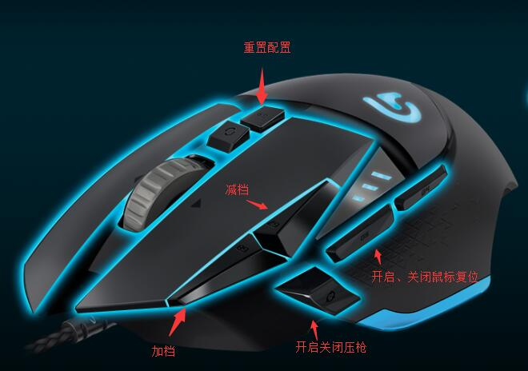

# Files 文件
## G502-config.xml
G502 Logitech-driven configuration files can be imported and used.
G502 罗技驱动的配置文件，导入就可以使用。

## macro-G502.lua
Source Code of G502 Macro.
G502宏的源码。

#  English
My machine translation may not be accurate.

## Info
&nbsp;&nbsp;Technology is no good, nothing is worthless. The development environment of this macro is G502, which is suitable for several keys such as G key, DPI +, DPI-, forward key and G9 key.
&nbsp;&nbsp;Macros are closed by default and need to be started and closed manually.
&nbsp;&nbsp;It's said that the import needs to be set as a permanent configuration file, otherwise it won't work. I haven't tested it. I've always been permanent anyway.

## Major Function
1:Open and close macros freely
2:The force of pressure gun can be adjusted
3:Mouse position can be restored after gun pressing

## Force Gear Position
1:The top grade is adjusted according to AK.
2:Mid-range is based on M4 (default)
3:The lowest gear is adjusted according to the submachine gun.

## Button Introduction
G key = open and close pressure gun.

DPI+= Upgrade a gear, the bigger the gear, the higher the pressure gun strength.

DPI - = Down a gear, the smaller the gear, the lower the pressure gun strength.

Forward key = Open mouse reset, that is, after pressing the gun, the mouse automatically restores to the position before pressing the gun.

G9 key = configuration reset key, used to restore to the default configuration, the default configuration is: close the pressure gun, close the mouse reset, default 2 files.

# 中文
## 介绍
&nbsp;&nbsp;技术不行，啥都白扯。本宏的开发环境是G502，适用于具有G键、DPI+、DPI-、前进键、G9键这几个键。
&nbsp;&nbsp;宏默认为关闭状态，需要手动启动和关闭。
&nbsp;&nbsp;说是导入时需要【设为永久性配置文件】，否则不生效，这个我没测试过，反正我一直都是永久的。

## 主要功能
1：可自由开启、关闭宏
2：可以调节压枪的力度
3：可以在压枪后复原鼠标位置

## 档位：
3：最高档是根据AK调的
2：中档是根据M4调的（默认的）
1：最低档是根据冲锋枪调的

## 按钮介绍：
G键=开启、关闭压枪。
DPI+=上调一个档位，档位越大，压枪力度越高
DPI-=下降一个档位，档位越小，压枪力度越低
前进键=开启鼠标复位，就是压枪之后鼠标自动恢复到压枪之前的位置
G9键=配置复位键，用于还原成默认配置的，默认配置是：关闭压枪、关闭鼠标复位、默认2档。

# G502 Graphic 图解
